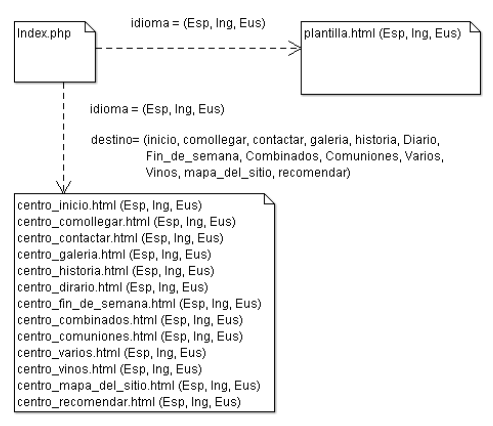
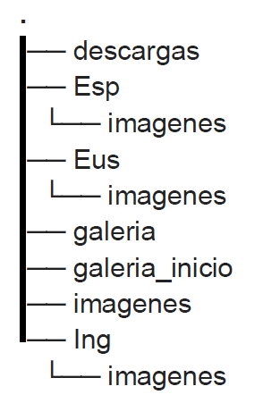
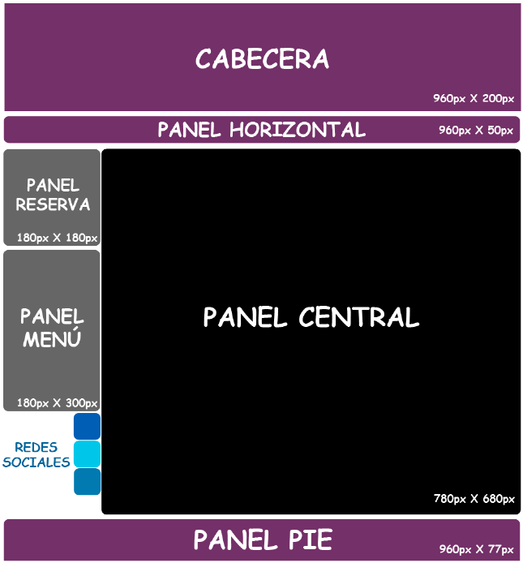
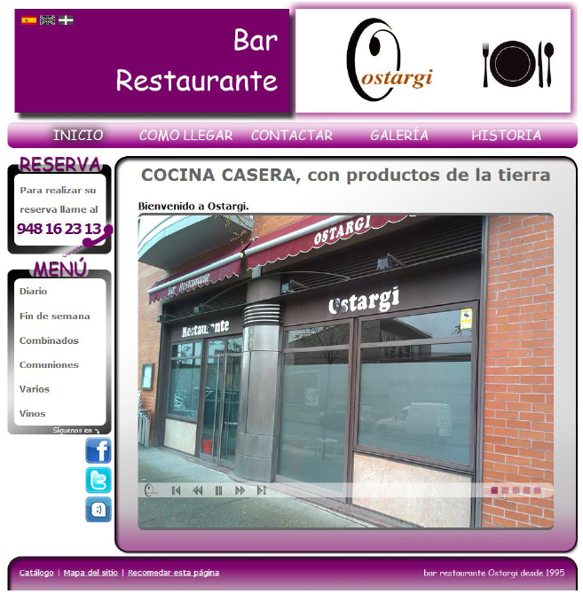

- [TÍTULO DE PROYECTO](#título-de-proyecto)
  - [Antecedentes](#antecedentes)
- [REQUISITOS](#requisitos)
  - [Requisitos funcionales](#requisitos-funcionales)
- [ANÁLISIS Y DISEÑO WEB](#análisis-y-diseño-web)
  - [Prototipo web y boceto de la estructura](#prototipo-web-y-boceto-de-la-estructura)
  - [Guía de estilos](#guía-de-estilos)
  - [Planificación de tareas](#planificación-de-tareas)
  - [Base de datos](#base-de-datos)
    - [Diseño Entidad Relación de la BBDD](#diseño-entidad-relación-de-la-bbdd)
    - [Modelo relacional BBDD](#modelo-relacional-bbdd)
    - [Script de creación BBDD](#script-de-creación-bbdd)
    - [Consultas](#consultas)
  - [Validación de formularios](#validación-de-formularios)
  - [Proceso de carga](#proceso-de-carga)
  - [Jerarquía de directorios](#jerarquía-de-directorios)
    - [Contenido directorios](#contenido-directorios)
  - [Diseño de la interface](#diseño-de-la-interface)
    - [Estructura gráfica de la interface](#estructura-gráfica-de-la-interface)
- [IMPLEMENTACIÓN](#implementación)
  - [REQUISITO 1: Diseño responsive](#requisito-1-diseño-responsive)
    - [Funcionamiento](#funcionamiento)
    - [Ejemplo de código](#ejemplo-de-código)
  - [REQUISITO 2: ...](#requisito-2-)
- [PRUEBAS](#pruebas)
  - [Metodología de las pruebas](#metodología-de-las-pruebas)
- [DESPLIEGUE](#despliegue)
- [HERRAMIENTAS](#herramientas)
- [LENGUAJES](#lenguajes)
- [PRODUCTO](#producto)
  - [Página de Inicio](#página-de-inicio)
- [BIBLIOGRAFÍA](#bibliografía)

# TÍTULO DE PROYECTO
## Antecedentes
Breve descripción del proyecto.

Este proyecto muestra todos los pasos a seguir para recolectar, organizar, tratar y construir un
portal Web empezando desde cero, para ...

Se han utilizado distintos lenguajes de programación, como pueden ser PHP y JavaScript para
su desarrollo, y para su diseño se ha hecho uso de Photoshop y de estilos CSS...

# REQUISITOS

Se describen de forma concisa los requisitos funcionales de vuestra aplicación.
## Requisitos funcionales

Se enumeran todos lo requisitos funcionales de vuestra aplicación.

Además de los requisitos de vuestra aplicación hay que añadir los siguientes:

- Diseño responsive
- Control de errores en formularios que deben incluir como mínimo un registro de usuario
  - DNI
  - Teléfono
  - Mail
  - Fecha de nacimiento
  - Teléfono 
  - Dirección
  - Provincia (elegible desde un desplegable)
  - Población (se rellenará según los datos de la provincia seleccionada.)
- Acceso restringido a usuarios no registrados  

# ANÁLISIS Y DISEÑO WEB

Breve descripción del mapa web. Se debe incluir la imagen del mapa web de vuestro proyecto.

Debe contener todo el itinerario de vuestra web. Todas las páginas y el hilo de navegación
## Prototipo web y boceto de la estructura

Mookup del proyecto. Deben coincidir el número de bocetos con el número de pantallas que hayais mostrado en el mapa web
## Guía de estilos

Debemos señalar los colores corporativos y el diseño del logo. Justificando su uso.
## Planificación de tareas

Con un diagrama de Gantt, planificamos el desarrollo del proyecto. Pautando qué vamos hacer y cuándo lo vamos a finalizar.

## Base de datos
### Diseño Entidad Relación de la BBDD

Realizamos el Esquema Entidad Relación de la BBDD de nuestra aplicación.

Se debe mostrar el diseño relacional. No lo que os muestra la aplicación MySQL Workbench o el gestor que usais. Quiero los diagrmas E-R con cajas para las entidades y rombos para las relaciones. Se deben tener en cuenta las cardinalidades.
### Modelo relacional BBDD

Se muestra el diseño de la BBDD según el GUI que esteís usando. Deben aparecer todas las entidades en la 3FN, los campos de las tablas y las cardinalidades. 
### Script de creación BBDD

Scrip de creación de las BBDD, sin los datos. Cada una de las tablas con sus claves referenciadas. 

El lector debe comprender lo que está leyendo, no se pone el script sin más, hay que explicarlo.

### Consultas 

Se incluyen y describen todas las consultas que se emplean en el desarrollo del proyecto.

## Validación de formularios

Se incluyen todos los formularios que se emplean en la WEB y se especifican qué tipo de validación se va ha realizar.
## Proceso de carga

Descripción del proceso de carga de vuestra aplicación. Por ejemplo:

> Al introducir la URL proyecto.com en el navegador, el fichero “index.php” carga la plantilla, dependiendo del idioma (Esp, Eus o Ing), cargará una plantilla u otra, por defecto “plantillaEsp.html”.
> 
> El proceso se muestra en el siguiente diagrama:
>
>

## Jerarquía de directorios

Mostramos el árbol de directorios de nuestro proyecto WEB, tal y como lo visualizaríamos en la carpeta WWW.

Podemos usar la herramienta `tree -d` en entorno linux.



### Contenido directorios

Breve explicación de lo que tenemos contenido en cada directorio. Por ejemplo:

> `./` -> Contiene los ficheros principales “index.php”, “estilos.css”, “realizar_recomendacion.php”, “realizar_enviao.php”, “descargas.php” y “javascript.js”.
> 
> `descargas` -> Contiene los archivo PDF descargables desde el sitio web.
> 
> `Esp` -> Contiene las imágenes y las páginas web en español.
> 
> `Eus` -> Contiene las imágenes y las páginas web en euskera.
> 
> ...

## Diseño de la interface

En base al apartado [Prototipo web y boceto de la estructura](#prototipo-web-y-boceto-de-la-estructura) describimos el contenido de la interface de nuestra aplicación. Por ejemplo:

> El sitio web consta de cinco partes fundamentales. Esta estructura es común en todas las páginas que forman el sitio web.
> 
> **Cabecera**: Contiene el logo de la empresa, que está formado por las siglas “ostargi” cruzadas por una “O” mayúscula. Además, en la parte superior de la cabecera, está el menú de selección de idioma.
> 
> **Panel horizontal**: Esta ubicado justo debajo de la cabecera. Contiene los enlaces a las páginas: inicio, como llegar, contactar

### Estructura gráfica de la interface

Mostramos la estructura gráfica de nuestro diseño. Por ejemplo.



# IMPLEMENTACIÓN

Descripción detallada de cada requisito, incluyendo su funcionamiento, validaciones si fuesen necesarias, y cualqier información relevante.

**Por ejemplo:**

## REQUISITO 1: Diseño responsive

Cada vez hay mas usuarios de Internet que utilizan dispositivos móviles para navegar. Si nos fijamos en la analítica de nuestra web, nos damos cuenta que cada vez hay un gran numero de visitas que provienen de dispositivos móviles, por lo que las resoluciones a las cuales vemos nuestro desarrollo son diferentes.

La principal necesidad que existe para hacer un diseño «adaptable», es porque se pierden bastantes visitantes, al no tener el site adaptable a todos.
### Funcionamiento

Para incluir un diseño responsive en la WEB se ha empleado CSS, y el framework Bootstrap.
### Ejemplo de código

Para la zona de publicacione se ha empleado el siguiente código:

```css
.blog-pagination {
    margin-bottom: 4rem;
}
 
.blog-pagination > .btn {
    border-radius: 2rem;
}
 
 
.blog-footer {
    padding: 2.5rem 0;
    color: #999;
    text-align: center;
    background-color: #f9f9f9;
    border-top: .05rem solid #e5e5e5;
}
```
## REQUISITO 2: ...

Esto se realiza para cada uno de los requisitos de nuestra aplicación.

# PRUEBAS

Breve descripción de cómo se han realizado las pruebas. Por ejemplo:

> Para la realización de las pruebas he montado una máquina virtual con linux + apache + mysql + php.
> 
> A lo largo del desarrollo he subido diferentes versiones y comprobado las diferentes funcionalidades.

## Metodología de las pruebas

Descripción de las pruebas que se han realizado para probar el funcionamiento de toda la aplicación. 

Imprescindible comprobar el CRUD y el acceso público y privado de nuestra aplicación.

# DESPLIEGUE

Creación de un Script en BASH que permita el despliegue en automático de la aplicación en cualquier servidor linux, que contenga un Apache+PHP y una base de datos SQL.

Se copia y describe el funcionamiento del script.

# HERRAMIENTAS

Descripción de todas las herramientas que se han usado para el desarrollo del proyecto. Por ejemplo:

> Para la realización del proyecto se han empleado las siguientes herramientas:
> ## Visual Studio
> 
> Descripción de Visual Studio
> 
> ### Características
> 
> Breve descripción de las características y plugins que hemos usado 
> 

# LENGUAJES

Descripción de los lenguajes y frameworks utilizados para el desarrollo del proyecto. Por ejemplo:

> ## HTML
> 
> Descripción de qué es HTML
> 
> ### Características
> 
> Breve descripción de sus características  
> 

# PRODUCTO

Se muestran diferentes pantallas que constituyen el desarrollo final de la aplicación:

## Página de Inicio



Y lo vamos realizando con todas las pantallas.
# BIBLIOGRAFÍA

Incluye la bibliografía y webgrafía que hayas empleado para el desarrollo de tu proyecto.


